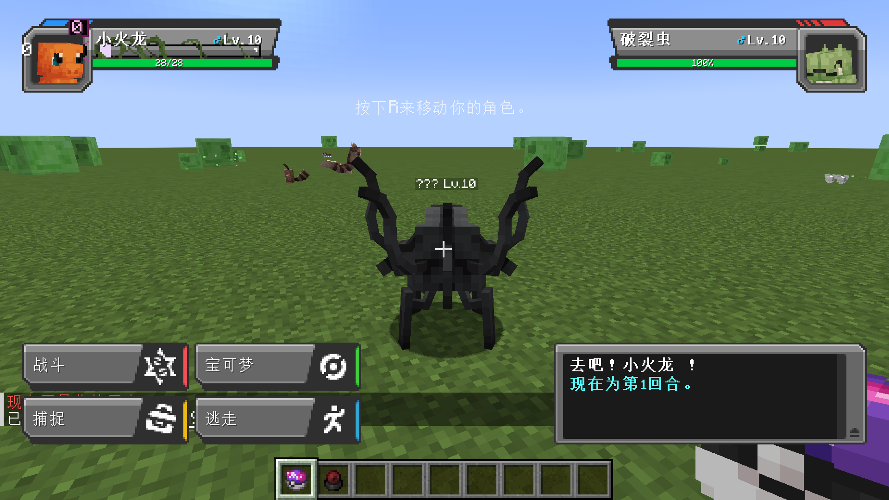

# CSRPmon — Parasite Battles

A NeoForge **1.21.1** addon that turns [Scape and Run: Parasites](https://www.curseforge.com/minecraft/mc-mods/scape-and-run-parasites)
(CSRP) creatures into real [Cobblemon](https://cobblemon.com/) Pokémon: they stop hunting you,
they fight in turn-based battles, and you can catch them with a Poké Ball.

Installed alongside Cobblemon, a CSRP parasite is not a mob that charges you any more — it is a wild
Pokémon standing in the field, waiting to be battled or caught.

---

## What it does

| | |
|---|---|
| **24 CSRP creatures become Cobblemon species** | Full type chart, base stats, abilities, learnsets, drop tables, catch rates and evolution lines, all loaded as ordinary Cobblemon species data. |
| **They stop attacking on their own** | SRP's proactive hunting goal is removed and target acquisition is vetoed, so a parasite walks past you instead of charging. It still fights back if you hit it first (configurable). |
| **Battles run on Cobblemon's engine** | Moves, damage, status, weather, AI, experience, catching, nuzlocke rules — all Cobblemon. This addon only starts the encounter. |
| **The creatures keep their own look** | Battles are rendered with CSRP's own models, textures and animations, not substitutes. |
| **Wild levels follow the SRP progression** | A parasite's Pokémon level rises with the world's CSRP evolution phase, so late-game hives are genuinely dangerous. |

## Verified working



A wild CSRP `rupter` met in a real client: it started a normal Cobblemon battle, it is drawn with its
own CSRP model rather than Cobblemon's Substitute placeholder, and the species name resolves in
Chinese. The full evidence — including the production crash that the first implementation caused —
is in [`docs/VERIFICATION.md`](docs/VERIFICATION.md).

## ⚠ Before you start: CSRP currently does not boot on its own

While verifying this addon I found that **CSRP 1.10.8 crashes during startup by itself**, with no
addons installed at all:

```
Mod loading issue for: csrp
Failure message: csrp encountered an error while dispatching the EntityAttributeCreationEvent event
    java.lang.IllegalStateException: Cannot get config value before config is loaded.
        at alku.csrp.config.MobsConfig.shycoHealthMultiplier(MobsConfig.java:391)
        at alku.csrp.entity.LongarmsEntity.createAttributes(LongarmsEntity.java:88)
```

CSRP's own `run/crash-reports/` already contained this exact failure from before this addon existed.
The cause is that `createAttributes()` reads `ModConfigSpec` values, while NeoForge fires
`EntityAttributeCreationEvent` before config files are loaded.

`tools/csrp_early_config_hotfix.mjs` fixes it in place (idempotent, `--dry-run` supported):

```bat
node tools/csrp_early_config_hotfix.mjs --csrp-src ../csrp/src/main/java/alku/csrp
```

It guards 465 config reads so they fall back to their declared default until the config is loaded,
and behave exactly as before afterwards. Revert with:

```bat
cd ../csrp
git checkout -- src/main/java/alku/csrp/Config.java src/main/java/alku/csrp/config
```

Full details and all verification evidence: [`docs/VERIFICATION.md`](docs/VERIFICATION.md).

## Requirements

| Component | Version |
|---|---|
| Minecraft | 1.21.1 |
| NeoForge | 21.1+ |
| CSRP | 1.10+ (built against 1.10.8) |
| Cobblemon | 1.7+ (built against 1.8.1+1.21.1) |
| Kotlin for Forge | 5.10+ (required by Cobblemon) |
| Java | 21 |

CSRPmon refuses to load without CSRP and Cobblemon, because the whole point is the bridge between
them.

## Installing

1. Drop `csrpmon-1.0.0.jar` into `mods/`.
2. Make sure CSRP, Cobblemon and Kotlin for Forge are there too.
3. Start the game. `config/csrpmon-common.toml` is written on first launch.

## Playing

Walk up to any parasite and:

* **right-click it while holding a Poké Ball**, or
* **sneak and right-click it** (if `sneakAlsoStartsBattle` is left on).

The creature is replaced by a wild Pokémon of the matching species and Cobblemon starts a normal
wild battle. From there everything is standard Cobblemon:

* throw Poké Balls to **catch** it — it goes into your party like any other Pokémon,
* **battle** it with your own team for experience, type match-ups and status effects,
* run away and the creature is **put back into the world** instead of being deleted.

### Species

| CSRP creature | Pokémon species | Types | Tier |
|---|---|---|---|
| `buglin` | Buglin | Bug | 1 |
| `gnat` | Gnat | Bug / Flying | 1 |
| `lice` | Lice | Bug | 1 |
| `rupter` | Rupter | Bug / Fire | 2 |
| `mangler` | Mangler | Bug / Dark | 2 |
| `worker` | Worker | Bug | 2 |
| `heed` | Heed | Psychic | 2 |
| `thrall` | Thrall | Dark / Fighting | 3 |
| `host` | Host | Dark / Poison | 3 |
| `dredge` | Dredge | Ground / Steel | 3 |
| `carrier_light` | Light Carrier | Flying / Dark | 3 |
| `pri_vermin` | Primitive Vermin | Bug / Dark | 3 |
| `carrier_heavy` | Heavy Carrier | Dark / Steel | 4 |
| `pri_longarms` | Primitive Longarms | Fighting | 4 |
| `pri_summoner` | Primitive Summoner | Psychic / Dark | 4 |
| `pri_viscera` | Primitive Viscera | Poison / Ghost | 4 |
| `hostii` | Host II | Dark / Poison | 4 |
| `marauder` | Marauder | Fighting / Dark | 5 |
| `architect` | Architect | Steel / Psychic | 5 |
| `crux` | Crux | Rock / Psychic | 5 |
| `draconite` | Draconite | Dragon / Rock | 6 |
| `kirin` | Kirin | Electric / Dragon | 6 |
| `anc_dreadnaut` | Ancient Dreadnaut | Steel / Dragon | 6 |
| `anc_overlord` | Ancient Overlord | Dark / Dragon | 6 |

### Evolution lines

```
buglin  --14--> rupter
lice    --16--> mangler
gnat    --22--> carrier_light --40--> carrier_heavy
worker  --24--> thrall --36--> host --50--> hostii
heed    --26--> dredge
pri_vermin --38--> pri_longarms --52--> pri_summoner
crux    --55--> draconite
```

A caught parasite evolves the normal Cobblemon way: level it up.

## Configuration

`config/csrpmon-common.toml`

```toml
[behaviour]
	# Remove the proactive targeting goals from every CSRP creature and refuse
	# to let them acquire a target they did not get attacked by.
	pacifyCreatures = true
	# Allow a CSRP creature to target the entity that just damaged it.
	retaliateWhenAttacked = true

[battle]
	encountersEnabled = true
	# A battle only starts when the player holds a Cobblemon Poke Ball.
	requirePokeBall = true
	# Sneaking and interacting also starts a battle.
	sneakAlsoStartsBattle = true
	# Wild CSRP Pokemon gain this many levels per CSRP evolution phase.
	levelBonusPerEvolutionPhase = 2
	maxLevel = 100
	# If the player runs away, put the CSRP creature back into the world.
	restoreCreatureAfterFlee = true
```

Setting `pacifyCreatures = false` restores SRP's original hunting behaviour while keeping battles
available.

## How it works

Three pieces, each deliberately small:

1. **Species data** — 24 JSON files in `data/csrpmon/species/`. Cobblemon's `PokemonSpecies`
   registry scans every namespace under `data/<ns>/species/`, so no registration code is needed;
   the species get types, stats, learnsets, drops and evolution lines from these files alone.
2. **The encounter** — `WildEncounterManager` listens for a player interacting with a CSRP creature,
   spawns a `PokemonEntity` carrying the matching species and calls Cobblemon's own
   `BattleBuilder.pve(player, entity)`. The battle itself belongs entirely to Cobblemon.
3. **The model bridge** — Cobblemon resolves Pokémon models from its own Blockbench repository, so an
   addon species would render as a Substitute doll. `CsrpRenderEvents` catches NeoForge's ordinary
   `RenderLivingEvent.Pre` for the Pokémon entity and, for `csrpmon` species, cancels Cobblemon's
   model and asks the creature's *own* CSRP renderer to draw a mirrored client-side stand-in of the
   original entity. The creature therefore appears with its real model, texture and animation, in the
   world and in battle. This is deliberately an event rather than a Mixin into Cobblemon: the first
   Mixin-based attempt crashed production clients even though its target descriptor was verifiably
   correct (see [`docs/VERIFICATION.md`](docs/VERIFICATION.md) §2).

Pacification is a fourth, independent piece: `ParasitePacifier` removes `NearestAttackableTargetGoal`
from CSRP creatures on join and vetoes `LivingChangeTargetEvent` for any target the creature was not
attacked by.

See [`docs/ARCHITECTURE.md`](docs/ARCHITECTURE.md) for the full notes, including the Cobblemon API
surface this addon depends on.

## Building from source

The build compiles against two mod jars that are **not** redistributed here because of their size:

```
libs/
  Cobblemon-neoforge-1.8.1+1.21.1.jar        # from Modrinth
  kotlinforforge-5.12.0-all.jar              # dev runs only
  citadel-2.7.1-1.21.1.jar                   # dev runs only, CSRP dependency
  ldlib2.jar                                 # dev runs only, CSRP dependency
```

and CSRP itself, which is expected at `../csrp/build/libs/csrp-1.10.8.jar`. Override any of them:

```bat
gradlew.bat build -Pcsrp_jar=D:/path/to/csrp-1.10.8.jar -Pcobblemon_jar=D:/path/to/cobblemon.jar
```

Then:

```bat
set JAVA_HOME=D:\MC\jdk\jdk-21.0.2
gradlew.bat build          :: -> build/libs/csrpmon-1.0.0.jar
gradlew.bat runServer      :: dev smoke test
gradlew.bat runClient      :: dev client
```

## Verifying the data

`tools/validate_species.mjs` cross-checks every species file against the data Cobblemon will load it
with — types, abilities, moves, egg groups, evolution targets, drop items, and the Java mapping table
in both directions:

```bash
# abilities.js and moves.js come from Cobblemon's data/cobblemon/showdown.zip
node tools/validate_species.mjs \
  --showdown /tmp/sd \
  --csrp-src ../csrp/src/main/java/alku/csrp \
  --species src/main/resources/data/csrpmon/species \
  --mapping src/main/java/alku/csrpmon/species/ParasiteSpeciesMap.java
```

## Licence

MIT. CSRP and Cobblemon keep their own licences; this addon ships no assets from either.
